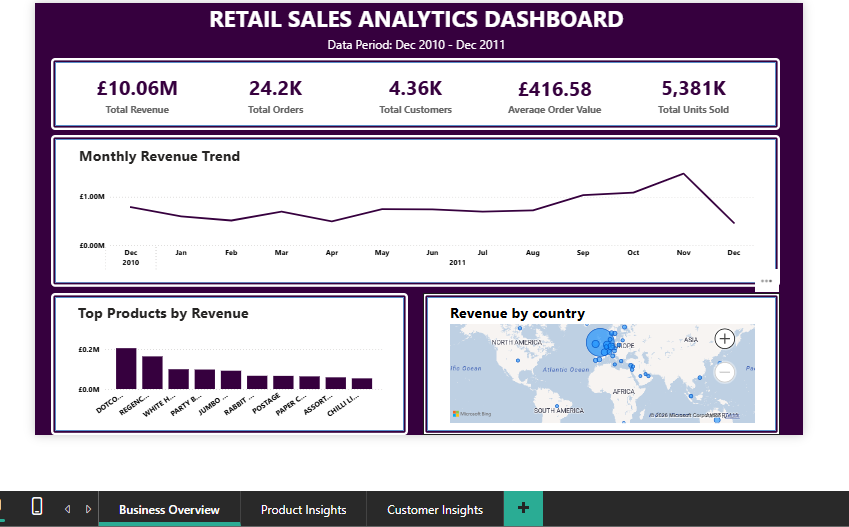
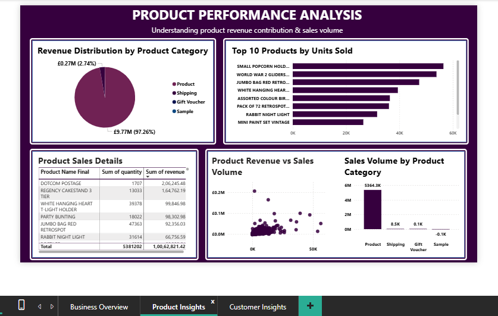
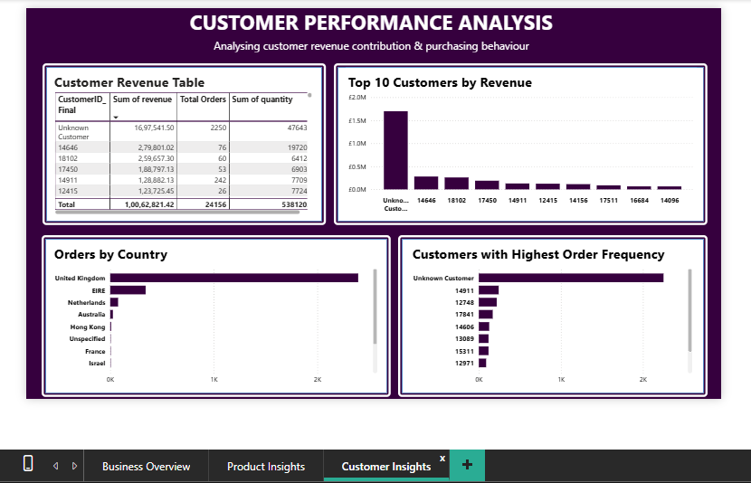

# Retail Sales Analytics Dashboard

## 📊 Project Overview

This project analyzes retail transaction data to uncover insights about **sales performance, product trends, and customer behavior**.

The analysis was conducted using:

- **SQL (PostgreSQL)** for data cleaning and transformation  
- **Power BI** for interactive dashboard visualization  

The final result is a **3-page Business Intelligence dashboard** that helps understand:

- Overall business performance
- Product performance
- Customer purchasing behavior

---

# 📁 Dataset

The dataset used is the **Online Retail Dataset**, which contains transactional data from a UK-based online retailer.

### Key Attributes

- Invoice Number
- Stock Code
- Product Description
- Quantity
- Invoice Date
- Unit Price
- Customer ID
- Country

Total records analyzed: **~540,000 transactions**

---

# 🧹 Data Cleaning (SQL)

Data preparation was performed using **PostgreSQL**.

Key cleaning steps:

- Removed cancelled orders (`InvoiceNo starting with 'C'`)
- Removed non-product stock codes  
  (`B, D, M, C2, AMAZONFEE, BANK CHARGES, CRUK`)
- Removed invalid transactions with **negative quantities**
- Investigated and handled **missing product descriptions**
- Standardized Stock Codes using `UPPER()`
- Created a **net revenue model** for valid transactions

---

# ⭐ Data Modeling

A **Star Schema** was implemented to structure the data.

## Fact Table

**fact_sales**

Contains transactional metrics:

- InvoiceNo
- StockCode
- CustomerID
- Order Date
- Quantity
- Unit Price
- Revenue

---

## Dimension Tables

### dim_product
- StockCode
- Product Name
- Product Type

### dim_customer
- CustomerID
- Country

### dim_date
- Order Date
- Day
- Month
- Year

### dim_country
- Country

---

# ⚠ Data Quality Handling

Some transactions contained **missing Customer IDs**.

Instead of removing these records, they were labeled as:

```
Unknown Customer
```

This ensures **revenue data is preserved** while maintaining analytical clarity.

---

# 🔎 Business Analysis (SQL)

Key business questions explored:

- Monthly revenue trends
- Top performing products by revenue
- Sales distribution by country
- Product category contribution
- Customer revenue contribution
- Customer order frequency

---

# 📈 Dashboard Overview

The Power BI dashboard consists of **three analytical pages**.

---

## 1️⃣ Business Overview

Provides a high-level snapshot of company performance.

Includes:

- Total Revenue
- Total Orders
- Total Customers
- Average Order Value
- Total Units Sold
- Monthly Revenue Trend
- Top Products by Revenue
- Revenue by Country

---

## 2️⃣ Product Performance Analysis

Focuses on product-level insights.

Includes:

- Revenue distribution by product category
- Top products by units sold
- Product revenue vs sales volume
- Product sales summary table
- Sales volume by product type

---

## 3️⃣ Customer Performance Analysis

Analyzes customer purchasing behavior.

Includes:

- Customer revenue table
- Top customers by revenue
- Orders by country
- Customers with highest order frequency

---

# 🛠 Tools Used

- PostgreSQL
- SQL
- Power BI
- Data Modeling (Star Schema)

---

# 📊 Key Insights

Key observations from the analysis:

- Revenue peaks during **November**, indicating seasonal demand.
- A small number of products generate a **large portion of total revenue**.
- The **United Kingdom dominates sales volume**.
- A few customers contribute significantly to total revenue.
- Product sales follow a **long-tail distribution** pattern.

---

# 📂 Project Structure

```
Retail_Analysis
│
├── Dataset
│     └── online_retail.csv
│
├── SQL
│     ├── data_cleaning.sql
│     ├── data_modeling.sql
│     └── analysis_queries.sql
│
├── PowerBI
│     └── retail_sales_dashboard.pbix
│
├── Images
│     ├── overview.png
│     ├── product_insights.png
│     └── customer_insights.png
│
└── README.md
```

---

# 🖼 Dashboard Preview

## Business Overview


---

## Product Performance Analysis


---

## Customer Performance Analysis


---

# 👩‍💻 Author

**Jahnavi Rangasai Parimi**

Aspiring Data Analyst  
SQL | Power BI | Data Analytics