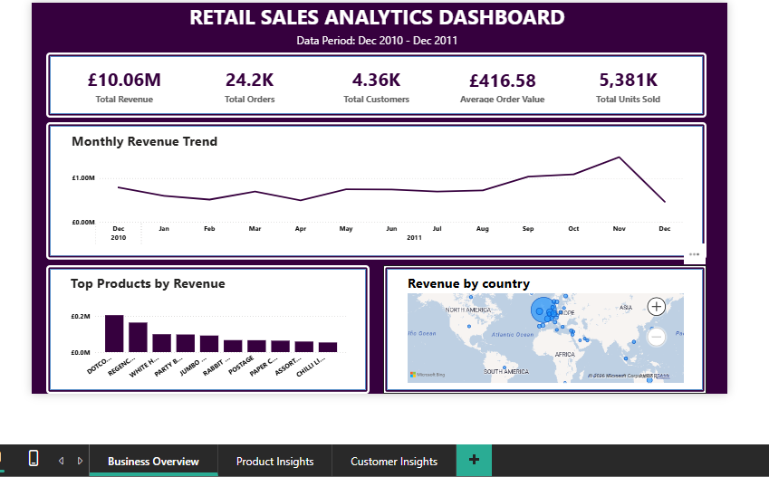
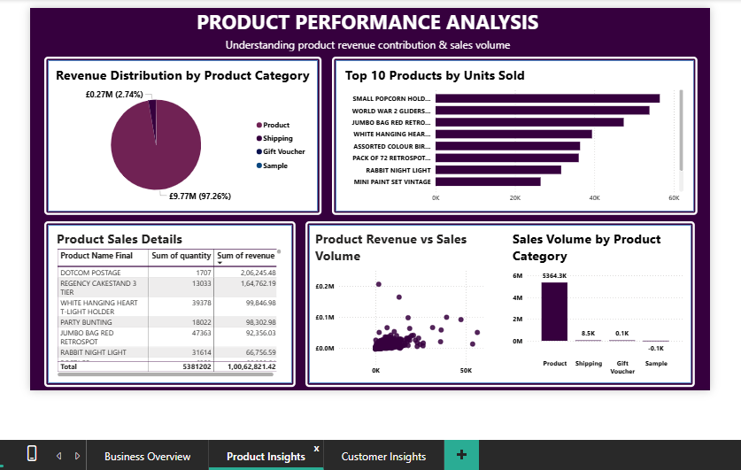
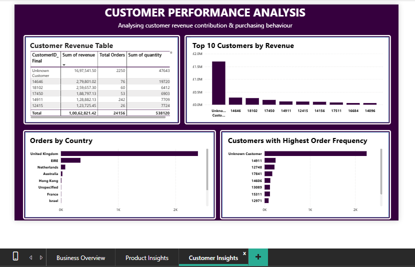

# Retail Sales Analytics & Power BI Dashboard

## 📊 Project Overview
This project analyzes **541,000+ retail transactions** to uncover critical insights about sales performance, product trends, and customer behavior. The goal was to transform raw transactional data into a structured **Data Warehouse** and build an interactive **Power BI Dashboard** to drive business decisions.

**Key Business Outcomes:**
- 💰 Identified **£10M+** in total revenue across multiple regions.
- 🇬🇧 Discovered that the **UK contributes ~85%** of total revenue, highlighting a heavy regional concentration.
- 📈 Pinpointed **November** as the peak revenue month (likely due to holiday sales), reaching **£1.47M** in a single month.
- 🏷️ Identified that a small subset of products drives the majority of revenue (Pareto Principle).

---

## 🚀 The Problem & Solution
| The Problem | The Solution |
| :--- | :--- |
| Raw data contained cancellations, missing customer IDs, and inconsistent stock codes, making analysis unreliable. | Performed rigorous **SQL Data Cleaning** (PostgreSQL) to remove invalid records and standardize data formats. |
| Leadership lacked a unified view of sales performance across products and regions. | Built a **Star Schema Data Model** and an interactive **3-page Power BI Dashboard** for real-time insights. |

---

## 🛠 Tech Stack
- **Database:** PostgreSQL
- **Visualization:** Power BI (DAX, Data Modeling, Interactive Dashboards)
- **Languages:** SQL (Joins, CTEs, Aggregations, Window Functions)
- **Tools:** Data Cleaning, ETL, Star Schema Design

---

## 🧹 Data Cleaning & Preparation (SQL)
Data was cleaned and transformed in PostgreSQL to ensure accuracy:

- **Removed Cancellations:** Filtered out orders with InvoiceNo starting with 'C'.
- **Filtered Invalid Records:** Excluded non-product stock codes (e.g., `B`, `D`, `M`, `AMAZONFEE`, `BANK CHARGES`).
- **Handled Missing Data:** Labeled transactions with missing Customer IDs as **"Unknown Customer"** to preserve revenue data.
- **Standardized Formats:** Converted Stock Codes to `UPPER()` and calculated **Net Revenue** (`Quantity * Unit Price`).

---

## 🏗️ Data Modeling (Star Schema)
A **Star Schema** was implemented to optimize query performance and DAX calculations:

**Fact Table:**
- `fact_sales`: Transactional metrics (InvoiceNo, StockCode, CustomerID, Date, Quantity, Unit Price, Revenue).

**Dimension Tables:**
- `dim_product`: StockCode, Product Name, Product Type.
- `dim_customer`: CustomerID, Country.
- `dim_date`: Order Date, Day, Month, Year.
- `dim_country`: Country details.

---

## ❓ Business Questions & Answers
This project answers critical business questions using SQL and Power BI:

### 1. What is the total revenue and which region dominates?
> **Answer:** Total revenue is **£10M+**. The **United Kingdom** accounts for **~85%** of total sales, indicating a heavy reliance on a single market.

### 2. When are sales highest?
> **Answer:** Revenue peaks in **November**, reaching **£1.47M** (likely due to holiday shopping). This is the optimal time for inventory and marketing focus.

### 3. Which products drive the most revenue?
> **Answer:** A small number of products generate the majority of revenue (Long-Tail Distribution). Top products by volume and revenue were identified for inventory optimization.

### 4. Who are the top customers?
> **Answer:** A select group of customers contributes significantly to total revenue. Top customers by revenue and order frequency were identified for loyalty programs.

### 5. How does customer behavior vary by country?
> **Answer:** Sales distribution varies significantly by country, with the UK showing the highest volume and average order value.

---

## 📊 Key Insights & Dashboard Overview

The final Power BI solution consists of **3 interactive pages**:

### 1️⃣ Business Overview
- **Metrics:** Total Revenue, Total Orders, Total Customers, Average Order Value (AOV).
- **Trends:** Monthly revenue trends and geographic distribution.

### 2️⃣ Product Performance
- **Metrics:** Revenue by product category, units sold, and product profitability.
- **Insight:** Identification of "Star" products vs. "Dog" products.

### 3️⃣ Customer Performance
- **Metrics:** Top customers by revenue, order frequency, and customer lifetime value.
- **Insight:** Segmentation of high-value vs. low-value customers.

| Metric | Value | Insight |
| :--- | :--- | :--- |
| **Total Revenue** | £10M+ | Massive scale with room for international expansion. |
| **Peak Month** | November | £1.47M revenue; critical for stock planning. |
| **Top Market** | UK | 85% of revenue; high concentration risk/opportunity. |
| **Missing Customers** | Labeled "Unknown" | Preserved data integrity without losing revenue context. |

---

## 🖼 Dashboard Preview
*(Note: Replace the image placeholders below with your actual dashboard screenshots)*

**Business Overview Page**

*High-level KPIs and monthly trends.*

**Product Performance Page**

*Product revenue distribution and top sellers.*

**Customer Performance Page**

*Top customers and order frequency analysis.*

---

## 📂 Project Structure

```
Retail_Analysis
│
├── Dataset
│     └── online_retail.csv
│
├── SQL
│     ├── data_cleaning.sql
│     ├── data_modeling.sql
│     └── analysis_queries.sql
│
├── PowerBI
│     └── retail_sales_dashboard.pbix
│
├── Images
│     ├── overview.png
│     ├── product_insights.png
│     └── customer_insights.png
│
└── README.md
```

---

## 🚀 Future Scope
- **Predictive Sales Forecasting:** Use historical data to predict next month's revenue using Time Series analysis.
- **Customer Segmentation:** Apply RFM (Recency, Frequency, Monetary) analysis to segment customers for targeted marketing.
- **Real-Time Dashboard:** Connect Power BI to a live database for real-time sales monitoring.

---

## 👩‍💻 Author
**Jahnavi Rangasai Parimi**  
*Data Analyst | SQL & Power BI Specialist*  
[LinkedIn Profile](https://linkedin.com/in/jahnavi-rangasai-parimi-b21364251/) | [GitHub Profile](https://github.com/jahnavi1473/Data-Portfolio)
