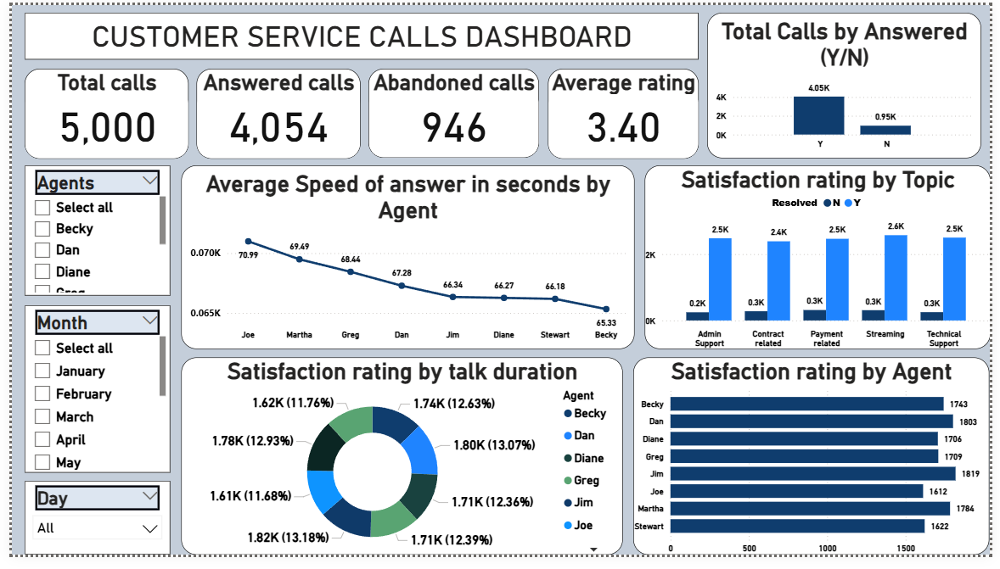
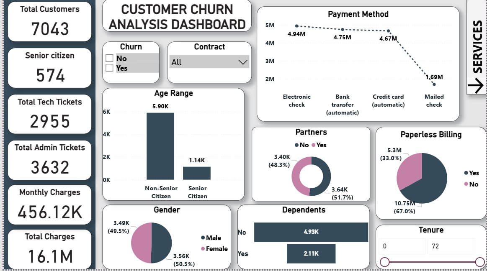
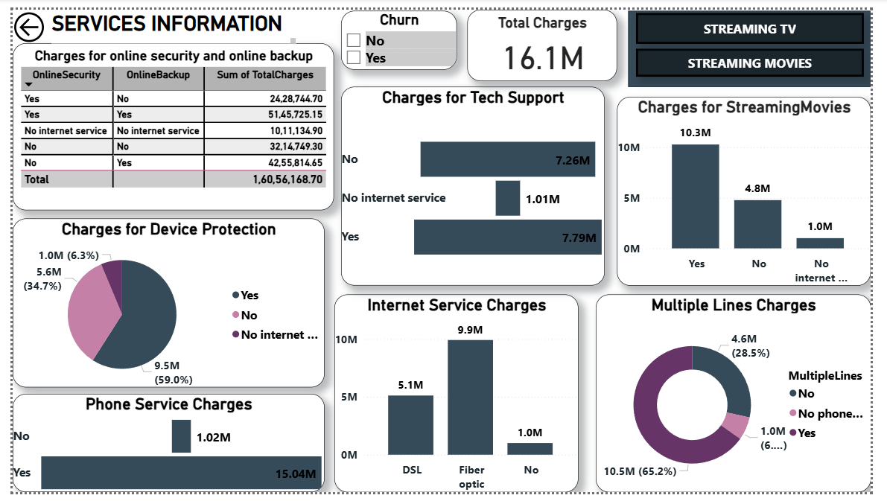
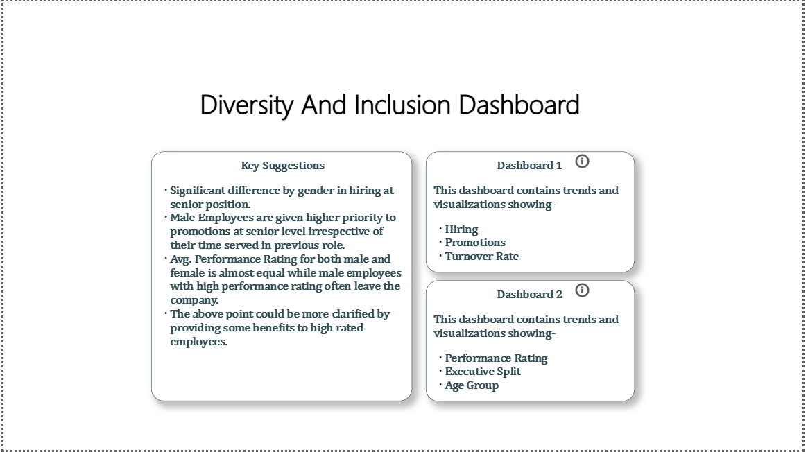
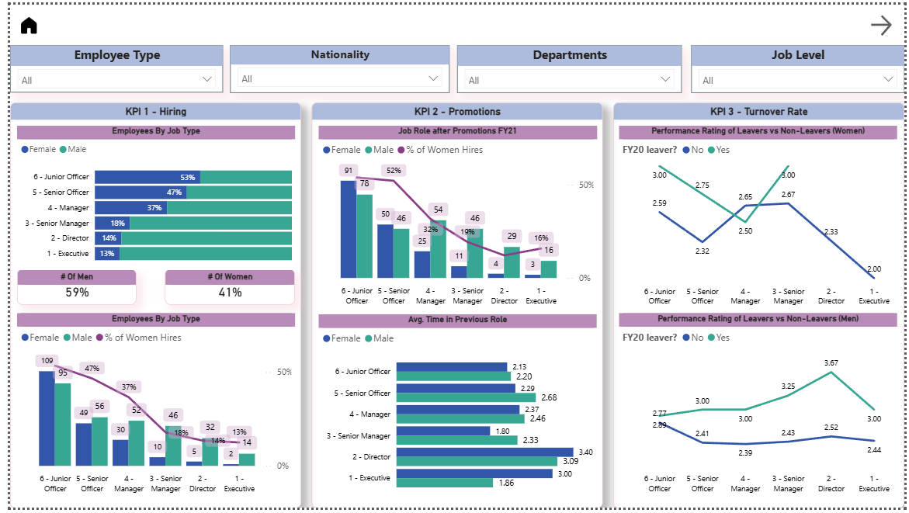
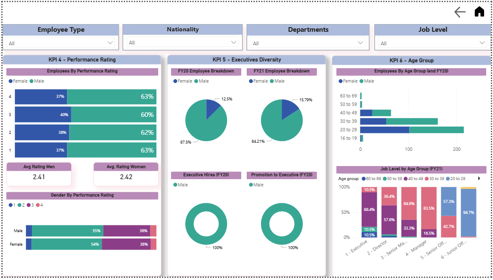

# PwC Switzerland – Power BI Business Intelligence Simulation

## 🏢 Project Overview
This project simulates a real-world consulting engagement with **PwC Switzerland**, focusing on transforming raw operational and workforce data into actionable strategic insights. The goal was to build three distinct **Power BI dashboards** addressing critical business challenges: **Call Centre Efficiency**, **Customer Churn & Revenue**, and **Diversity & Inclusion**.

**Key Business Outcomes:**
- 📞 **Operational Efficiency:** Analyzed call centre trends to identify bottlenecks in service delivery and agent performance.
- 📉 **Revenue Retention:** Uncovered patterns in customer churn and service usage to inform retention strategies.
- 👥 **Workforce Equity:** Evaluated diversity metrics across job levels and promotions to support inclusive hiring goals.

---

## 🚀 The Problem & Solution
| The Business Challenge | The Analytical Solution |
| :--- | :--- |
| **Call Centre Bottlenecks:** Lack of visibility into abandonment rates and agent performance impacting customer satisfaction. | Built an **Interactive Call Centre Dashboard** tracking ASA, abandonment rates, and satisfaction by topic to optimize staffing. |
| **High Customer Churn:** Unclear drivers of customer attrition and revenue loss across different service tiers. | Developed a **Churn & Revenue Model** using DAX to segment customers by demographics, payment method, and contract type. |
| **Diversity Gaps:** Inability to track progress on gender representation and promotion equity across the organization. | Created a **Diversity & Inclusion Dashboard** visualizing hiring trends, executive representation, and performance ratings by gender. |

---

## 🛠 Tech Stack
- **Visualization:** Power BI (Desktop & Service)
- **Data Modeling:** Star Schema, Relational Modeling, Data Transformation (Power Query)
- **Languages:** DAX (Measures, Calculated Columns, Time Intelligence)
- **Skills:** KPI Design, Executive Reporting, Customer Analytics, HR Analytics

---

## 📊 Task Breakdown & Insights

### 1️⃣ Task 1: Call Centre Trends Analysis
**Objective:** Optimize call centre operations and improve customer satisfaction scores.

**Key Metrics Analyzed:**
- Total Calls & Abandonment Rate
- Average Speed of Answer (ASA)
- Customer Satisfaction by Topic
- Agent Performance Benchmarks

**🔍 Key Insights:**
- Identified peak call times correlating with high abandonment rates.
- Discovered specific topics with lower satisfaction scores, indicating training gaps.
- **Impact:** Recommendations for dynamic staffing and targeted agent coaching.


*[View Detailed Insights](insights/business-insights-task-1.md)*

---

### 2️⃣ Task 2: Customer Churn & Revenue Analysis
**Objective:** Understand customer behavior to reduce churn and maximize revenue.

**Key Metrics Analyzed:**
- Customer Demographics (Age, Gender, Dependents)
- Payment Methods & Contract Types
- Service-Level Revenue (Internet, Streaming, Tech Support)
- Paperless Billing Impact

**🔍 Key Insights:**
- Identified high-risk customer segments based on contract type and payment method.
- Revealed that **monthly contracts** had significantly higher churn than **2-year contracts**.
- **Impact:** Data-driven recommendations for retention offers and contract restructuring.



*[View Detailed Insights](insights/business-insights-task-2.md)*

---

### 3️⃣ Task 3: Diversity & Inclusion Analytics
**Objective:** Measure progress on diversity goals and identify representation gaps.

**Key Metrics Analyzed:**
- Gender Distribution by Job Level & Department
- Hiring & Promotion Trends (FY20 vs FY21)
- Executive Representation
- Performance Ratings by Gender

**🔍 Key Insights:**
- Highlighted a "leaky pipeline" where female representation drops significantly at senior levels.
- Identified disparities in promotion rates between genders.
- **Impact:** Strategic roadmap for inclusive leadership development and hiring practices.




*[View Detailed Insights](insights/business-insights-task-3.md)*

---

## 📂 Project Structure

```
pwc-power-bi-simulation/
│
├── dataset/ # Raw source data files
├── powerbi/ # .pbix dashboard files
├── screenshots/ # Dashboard preview images
├── insights/ # Detailed business insight documents
└── README.md # Project overview
```

---

## 🎯 Competencies Demonstrated
- **Business Intelligence:** Translating vague business requirements into structured data models.
- **Data Storytelling:** Using visualizations to tell a compelling story about operational health and workforce equity.
- **Advanced DAX:** Creating complex measures for YoY growth, churn rates, and running totals.
- **Executive Communication:** Presenting findings in a format suitable for C-level stakeholders.

---

## 🚀 Future Scope
- **Predictive Churn Modeling:** Integrate Python/R scripts to predict future churn probability.
- **Real-Time Monitoring:** Connect dashboards to live operational databases for real-time call centre monitoring.
- **Automated Reporting:** Set up Power BI Dataflows for automated daily/weekly insight delivery.

---

## 👩‍💻 Author
**Jahnavi Rangasai Parimi**  
*Data Analyst | BI & Reporting*  
[LinkedIn Profile](https://linkedin.com/in/jahnavi-rangasai-parimi-b21364251/) | [GitHub Profile](https://github.com/jahnavi1473/Data-Portfolio)

> *Note: This project was completed as part of the PwC Switzerland Virtual Job Simulation program on Forage.*

